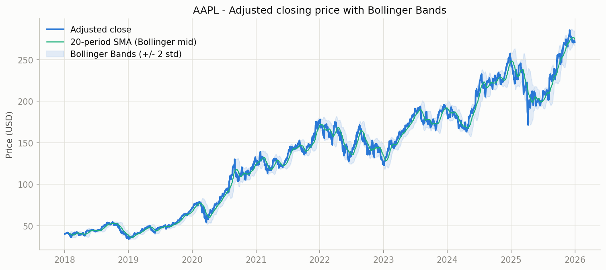
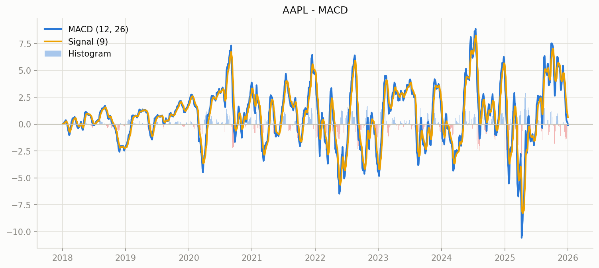
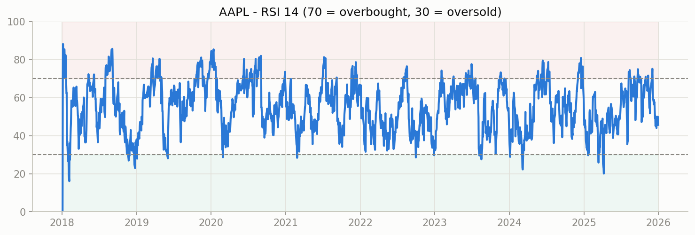
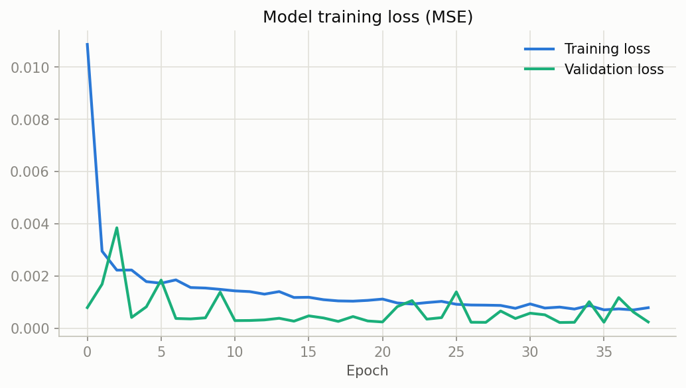
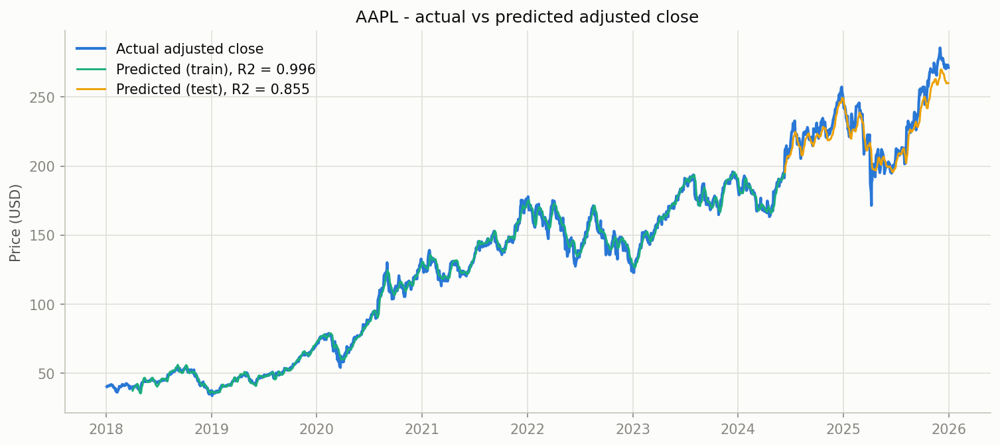
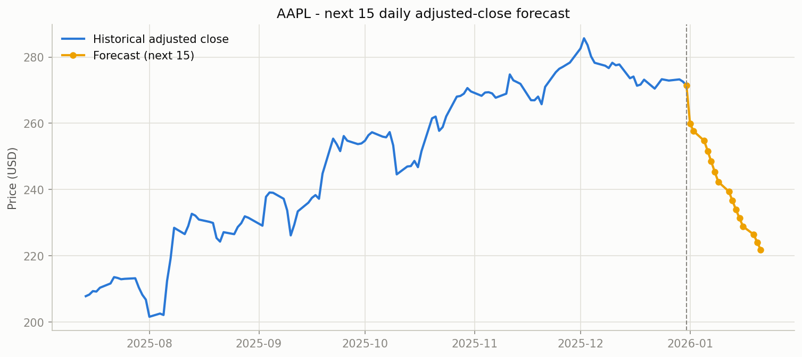

# Week 5 — Stock Price Prediction using LSTM (Part 1)

A deep-learning pipeline that predicts the **next 15 units** of a stock's
adjusted closing price with an LSTM network, using the adjusted close plus two
technical indicators (**MACD** and **RSI**) as input features.

Everything lives in one notebook: [`Stock_Prediction_LSTM.ipynb`](Stock_Prediction_LSTM.ipynb).

## How to run

```bash
pip install yfinance tensorflow scikit-learn pandas numpy matplotlib
jupyter notebook Stock_Prediction_LSTM.ipynb
```

Run all cells. The notebook prompts for:

| Input | Example | Default |
|---|---|---|
| Stock ticker | `AAPL`, `GOOGL` | `AAPL` |
| Start date | `2018-01-01` | `2018-01-01` |
| End date | `2026-01-01` | `2026-01-01` |
| Timeframe | `daily` / `weekly` / `monthly` | `daily` |

When the notebook is executed non-interactively (headless "run all"), the
defaults are used automatically. Data is fetched live from Yahoo Finance via
`yfinance`, and every figure is also saved as a PNG next to the notebook.

## Pipeline

1. **Data collection** — user inputs → `yfinance` download (adjusted OHLCV).
2. **Visualization** — adjusted close with Bollinger Bands, MACD, RSI.
3. **Preprocessing** — features `[Adj Close, MACD, RSI]` scaled to [0, 1] with
   `MinMaxScaler`; sliding windows of the past 60 steps; chronological 80/20
   train/test split (no shuffling, so the test set lies strictly in the
   model's future).
4. **Model** — stacked LSTM in TensorFlow/Keras:
   `LSTM(64) → Dropout(0.2) → LSTM(32) → Dropout(0.2) → Dense(1)`,
   Adam + MSE, early stopping on a 10 % validation tail (~30 k parameters).
5. **Prediction** — test-set evaluation with the R² score, then a recursive
   15-step forecast: each predicted close is appended to the price history and
   MACD/RSI are recomputed before predicting the next step.

## Why these indicators?

- **MACD (12, 26, 9)** — the gap between a fast and a slow EMA. It encodes
  trend direction *and* momentum in one signal; the histogram flips sign
  exactly where trend reversals tend to start, which gives the LSTM an early
  warning feature that raw prices only show later.
- **RSI (14)** — a bounded momentum oscillator (0–100). Readings above 70 /
  below 30 mark overbought / oversold conditions, i.e. stretches where the
  recent move is statistically likely to cool off — useful mean-reversion
  context that complements MACD's trend-following view.
- **Bollinger Bands (20, ±2σ)** are plotted for volatility context in the
  visualization section (not used as a model input).

## Results (default run: AAPL daily, 2018-01-01 → 2026-01-01)

| Metric | Value |
|---|---|
| R² (train) | **0.9956** |
| R² (test, last 20 % of the period) | **0.8549** |

### Tested on multiple stocks

The identical pipeline (same features, window, architecture, seed) was run on
four tickers over 2018-01-01 → 2026-01-01, daily. Test metrics cover the final
20 % of each period; RMSE/MAE are in dollars.

| Ticker | R² (train) | R² (test) | RMSE (test) | MAE (test) | Mean test price |
|---|---|---|---|---|---|
| AAPL  | 0.9956 | 0.8550 | $8.54  | $6.76  | $229.53 |
| GOOGL | 0.9917 | 0.9523 | $9.97  | $6.77  | $196.12 |
| MSFT  | 0.9905 | 0.8614 | $16.94 | $13.81 | $447.04 |
| TSLA  | 0.9840 | 0.8419 | $33.30 | $26.33 | $324.78 |

The model generalises consistently (test R² 0.84–0.95), with the weakest
scores on the most volatile ticker (TSLA) — typical error is ~3–8 % of the
mean test price. One honest caveat: a naive persistence baseline (predict
today's close = yesterday's close) scores an even higher test R² (0.97–0.99)
on every ticker. Near-random-walk price series make persistence extremely hard
to beat one step ahead; R² alone therefore overstates any model's practical
edge, which is worth keeping in mind when reading such results.








**Interpreting the results.** The model tracks the held-out test period
closely (R² ≈ 0.85) — solid for a compact LSTM evaluated on data entirely in
its future. The 15-step forecast is recursive, so prediction errors compound:
the curve tends to drift smoothly toward the recent trend rather than
reproducing day-to-day volatility. That is a known limitation of single-output
recursive forecasting and a natural target for Part 2 (direct multi-horizon
output or sequence-to-sequence decoding).
