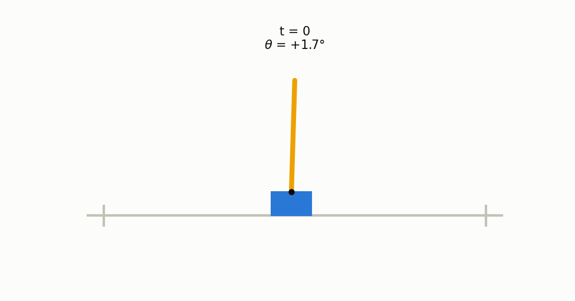

# Week 6 — Inverted Pendulum (Cart-Pole) with DQN

Solving the classic inverted pendulum control problem with reinforcement
learning: a pole is hinged on a cart, and the agent can only push the cart
left or right to keep the pole upright. The environment is Gymnasium's
`CartPole-v1`.

I used DQN instead of DDPG because the action space here is discrete (two
actions); DDPG is meant for continuous control.

Notebook: [`Inverted_Pendulum_DQN.ipynb`](Inverted_Pendulum_DQN.ipynb)

## How to run

```bash
pip install gymnasium tensorflow numpy pandas matplotlib
jupyter notebook Inverted_Pendulum_DQN.ipynb
```

Runs in about 4 minutes on CPU. Seeds are fixed, so the run is reproducible.
All figures are saved as PNGs next to the notebook.

## Method

- Q-network: MLP 4 → 128 → 128 → 2, Adam, Huber loss, γ = 0.99.
- Experience replay, soft-updated target network, ε-greedy 1.0 → 0.01.
- **Double DQN** target — with the vanilla max target, training plateaued
  around reward 320 (overestimation bias), so the online network picks the
  next action and the target network scores it.
- The greedy policy is evaluated every 20 episodes and the best weights are
  checkpointed. Training stops at the first perfect evaluation, because
  training longer made the agent forget and oscillate.

## Results

- Random policy: ~22 steps before the pole falls.
- Training reached a perfect greedy policy at episode 300.
- Official criterion: **100/100 consecutive greedy episodes at the 500-step
  cap (mean 500 ≥ 475) → solved.**
- Disturbance test: the pole is kicked with ±0.3 rad/s at steps
  100/200/300/400 — the controller recovers every time.



The pole sways about ±8° instead of standing perfectly still — with only two
full-force pushes there is no way to make fine corrections, so the
controller settles into a stable back-and-forth well inside the ±12° failure
bound.

Other figures in this folder: random policy failure, training curve, state
traces, disturbance test, balanced episode frames.
